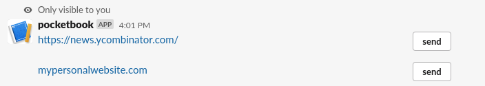
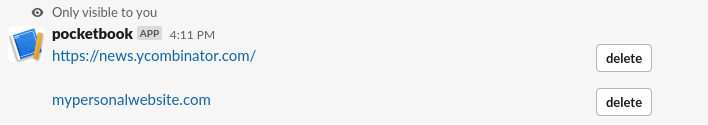

# Pocketbook

Slack app for storing links, messages, notes or any text for quick access.


### Requirements 
---
- [Create a Slack App](https://api.slack.com/apps)
- Set these environment variables
```
SLACK_BOT_TOKEN - bot token from the slack app
 
SLACK_APP_TOKEN - app token from the slack app

GOOGLE_APPLICATION_CREDENTIALS - service account to gain access to firestore
```

### How to use
---

- Add a new note
    - command - `/pocketbook https://news.ycombinator.com/`
    - respone - no response
- List all notes
    - command - `/pocketbook`
    - response 
        - 
- Send a note 
    - command - click on the `send` button to send a link to the channel
    - response 
        - 
- Delete a note 
    - command - `/pocketbook delete`
    - response 
        - click on the delete button
        - 


## How to run 

- without docker
    - install [Go](https://go.dev/doc/install)
    - make sure you have all the requirements fulfilled 
    - `make run` 

- build docker image 
    - `make docker-build`